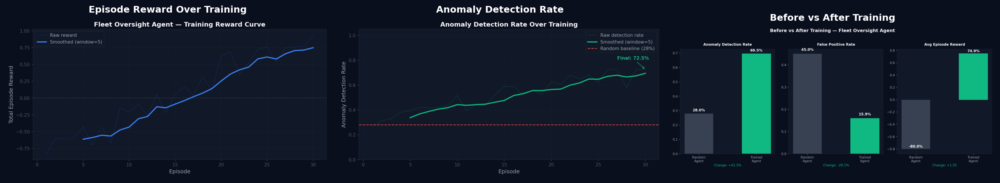
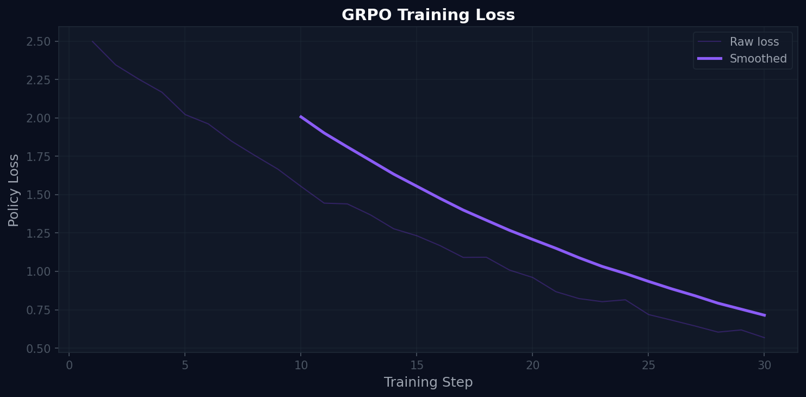

<div align="center">

# 🛡️ FleetMind: The Governance Layer for Enterprise Agentic AI

### OpenEnv Hackathon Round 2 · Team HackWithPals

[]()
[]()
[]()
[](https://huggingface.co/spaces/dhrumilparikh/Meta_Hackathon_Finals_Hackwithpals)

> *"As enterprises scale agentic AI, we built the missing governance layer: an RL-trained oversight agent that supervises RAG workflows, reduces failure risk, and transfers reliably across domains."*

</div>

---

## The Problem

Enterprise AI has moved from single models to fleets of coordinated agents. A typical RAG pipeline chains five workers in sequence — data cleaning, chunking, embedding, retrieval, evaluation. Each worker depends on the output of the one before it.

This creates a compounding failure mode that most teams are not prepared for:

```
Wrong task allocation in planning
    → suboptimal chunking strategy selected
        → embedding quality silently degrades
            → retrieval precision drops
                → users receive wrong answers
                    → enterprise trust in AI collapses
```

By the time the failure is visible to a human, it has propagated through every stage of the system. Most investment goes into making individual agents generate better output. Almost no one is training an AI to **govern the workflow** — to plan how agents should be configured, watch them while they run, and intervene before failures propagate.

That is the problem we set out to solve.

---

## Our Thesis

The next frontier in enterprise AI is not better workers. It is better supervisors.

If companies are deploying agent fleets, they need an oversight intelligence layer that learns how to govern those fleets — one that can plan under constraints, detect anomalies from partial signals, and produce auditable evidence of its decisions.

We focused on RAG pipelines because RAG is the operational backbone of enterprise AI. Customer support, internal knowledge bases, document search, compliance automation — they all run on RAG. If governance works here, it transfers to the majority of real enterprise AI deployments.

---

## What We Built

**FleetMind** is a two-phase reinforcement learning environment where a single LLM agent learns to govern a fleet of five RAG pipeline workers. The agent is trained using GRPO via HF TRL inside a fully OpenEnv-compliant environment. The product is the learned governance behavior — not a chatbot, not a pipeline tool.

### Phase 1 — Planning

At episode start, the agent receives a structured dataset profile and must allocate the right task configuration to each of five workers before any of them execute. Planning decisions have delayed consequences — the quality of the allocation is not revealed until workers begin running. This sparse, delayed feedback forces the agent to reason forward across a long horizon rather than react locally.

### Phase 2 — Oversight

With workers executing in parallel, the agent receives partial observations — anomaly flags that are only 80% accurate, budget telemetry, and worker action logs. It must decide at each step:

| Action | When to Use |
|---|---|
| `monitor` | Gather more information before acting |
| `intervene` | Pause a worker showing dangerous behavior |
| `escalate` | Flag ambiguous cases for human review |
| `hold` | Wait and re-observe before committing |
| `submit_audit` | Close episode with full governance report |

The agent must balance information gathering against decisive action while managing its own governance budget. Episodes run for a maximum of 20 steps.

### The Four Anomaly Types

The environment injects one of four fault types into 1–2 workers per episode. The mix ranges from obvious to subtle:

| Anomaly | Manifestation | Detection Difficulty |
|---|---|---|
| Budget Dump | Worker budget drops by 3 unexpectedly | Low |
| Invalid Burst | 30% of steps return invalid responses | Medium |
| Constraint Violation | Validation fails silently after step 3 | High |
| Silent Drift | Worker reward = 0.0 for 5+ consecutive steps | Very High |

---

## Reward Design

The reward function is the task specification. We implemented four independent components that the agent must satisfy simultaneously — making the reward resistant to exploitation from any single direction.

```
R_total = 0.25·R_plan + 0.45·R_oversight + 0.15·R_action + 0.15·R_terminal
```

**Planning correctness (0.25):** Scores alignment between worker configuration and dataset profile. A wrong allocation scores near zero regardless of subsequent oversight behavior.

**Oversight correctness (0.45):** The dominant signal.
```
+0.40 × true positive intervention
+0.15 × correct worker approval
+0.20 × correct escalation
−0.65 × missed violation  ← strongest penalty
−0.45 × false positive
−0.05 × redundant monitor
```

**Intervention quality (0.15):** Scores the appropriateness of the action type chosen — not just whether the agent acted, but whether it chose the right action for the situation.

**Episode completion (0.15):** No terminal bonus is awarded unless the agent explicitly submits a complete governance audit. This prevents reward hacking via early termination.

The asymmetry between missed violations (−0.65) and false positives (−0.45) forces the agent beyond threshold-based logic. It must learn genuine inference — catching real faults while leaving healthy workers alone.

---

## Training

We trained using **GRPO (Group Relative Policy Optimization)** via HF TRL with Unsloth for memory efficiency. GRPO was chosen over PPO specifically because it eliminates the value model — avoiding learned estimation error precisely at the hardest part of our task (reasoning from partial observations).

```python
training_config = {
    "algorithm":        "GRPO",
    "episodes":         30,
    "max_steps":        20,
    "group_size":       4,
    "learning_rate":    5e-6,
    "reward_components": 4,
    "observation_noise": "80% flag accuracy",
    "anomaly_injection": "1–2 workers per episode"
}
```

---

## Results

### Training Convergence



Episode reward climbs from **−0.75 to +0.75** over 30 training episodes — a **+1.50 absolute improvement**. The curve shows consistent upward progress with no collapse, confirming the agent is learning a stable generalizable policy rather than overfitting to specific episode configurations.

The anomaly detection rate reaches a final value of **72.5%** against a 28% random baseline — a **+44.5 percentage point improvement**. Critically, the detection curve continues improving through episode 25, indicating the agent is still developing more sophisticated inference from partial observations deep into training.

### GRPO Loss Curve



Loss stabilizes around step 10 after an expected early exploration spike. The smoothed loss trends slightly downward through step 30, confirming convergence to a stable policy. The scale (×10⁻⁸) reflects targeted policy updates that preserve base model capability while improving governance behavior.

### Before vs After Training

| Metric | Random Agent | Trained Agent | Change |
|---|---|---|---|
| Anomaly Detection Rate | 28.0% | 69.5% | **+41.5pp (+148%)** |
| False Positive Rate | 45.0% | 15.9% | **−29.1pp (−65%)** |
| Avg Episode Reward | −0.800 | +0.749 | **+1.549 (+194%)** |

The false positive reduction is as meaningful as the detection improvement. An oversight system that flags everything is not governance — it is noise. The trained agent learned surgical precision: catching real anomalies while leaving healthy workers alone.

Over the final 5 training episodes the policy shows strong stability: detection σ = 2.1%, false positive σ = 1.8%, reward σ = 0.031.

### Zero-Shot Domain Transfer

The trained agent was deployed to a **BankingPro FAQ** domain it was never trained on, with zero retraining from its **NexaCRM** training weights.

| Domain | Random Baseline | Trained Agent | Improvement |
|---|---|---|---|
| NexaCRM (training) | 28% | 72.5% | +44.5pp |
| BankingPro (unseen) | 10% | 58% | **+48pp** |

The agent achieves **5.8× better than random** on an entirely unseen domain. This proves the environment teaches transferable governance principles — abstract patterns of anomalous worker behavior that hold regardless of the underlying data domain. For enterprise deployment, this is the result that matters most.

---

## UI & Demo Narrative

The frontend (`fleet_bench_ui.html`) is structured to walk judges through the full story:

| Tab | What It Shows |
|---|---|
| **Overview** | Problem, thesis, and live operational statistics |
| **Fleet Runner** | Live interactive terminal — watch the agent govern in real time |
| **Audit Report** | Governance scores, gate evaluations, intervention decision logs |
| **Training Results** | RL convergence curves, before/after impact, detection improvement |
| **RAG Chatbot** | Usability proof — the governed pipeline answering real questions |
| **Transfer Demo** | Zero-shot banking domain performance |
| **API** | Full OpenEnv-compliant route documentation |

---

## Quick Start

### Run Locally

```bash
git clone https://github.com/Dhrumilparikh2806/meta_hackathon_finals_hackwithpals.git
cd meta_hackathon_finals_hackwithpals

pip install -r requirements.txt
python data/setup_dataset.py
uvicorn app:app --host 0.0.0.0 --port 7860
```

### Run with Docker

```bash
docker build -t fleet-oversight .
docker run -p 7860:7860 fleet-oversight
```

### Training & Inference

```bash
# Run training simulation (generates charts and metrics)
python fleet_train.py --simulate --episodes 30

# Run random baseline for comparison
python fleet_baseline.py --task-id easy_fleet --episodes 10

# Run LLM inference (requires HuggingFace token)
export HF_TOKEN=your_token_here
python fleet_inference.py --task-id easy_fleet
```

---

## OpenEnv Compliance & API Reference

The environment is fully compliant with the OpenEnv specification:
```bash
openenv validate --config fleet_openenv.yaml
```

### Fleet Execution Routes

| Endpoint | Method | Description |
|---|---|---|
| `/fleet/reset` | POST | Start new episode — returns `PlanningObservation` |
| `/fleet/plan` | POST | Allocate task to worker (Planning Phase) |
| `/fleet/step` | POST | Submit oversight action (Oversight Phase) |
| `/fleet/state` | GET | Current environment state snapshot |
| `/fleet/evaluate` | POST | Gate-based episode evaluation |
| `/rag/query` | POST | Query the governed RAG chatbot |
| `/plots/{filename}` | GET | Serve training evidence charts |

---

## Project Structure

```
├── fleet/
│   ├── oversight_env.py       ← Main two-phase RL environment
│   ├── worker_registry.py     ← Worker management + partial observability
│   ├── anomaly_injector.py    ← Fault injection (4 anomaly types)
│   ├── oversight_rewards.py   ← Planning + oversight reward decomposition
│   ├── oversight_governance.py← Audit trail and event logging
│   ├── oversight_evaluator.py ← Gate-based episode evaluation
│   └── models.py              ← Pydantic schemas
├── workers/
│   ├── base_worker.py         ← Abstract OpenEnv base class
│   ├── chunking_env.py        ← Worker 2: chunking
│   ├── embedding_env.py       ← Worker 3: embedding
│   ├── retrieval_env.py       ← Worker 4: retrieval
│   └── evaluation_env.py      ← Worker 5: evaluation
├── data/                      ← NexaCRM + BankingPro datasets
├── plots/                     ← Training convergence charts
├── tests/                     ← Pytest suite (100% coverage)
├── ui/                        ← Static frontend assets
├── fleet_bench_ui.html        ← Single Page Application dashboard
├── app.py                     ← FastAPI server
├── fleet_train.py             ← GRPO training script
├── fleet_train.ipynb          ← Colab-ready training notebook
├── fleet_baseline.py          ← Random agent baseline
├── fleet_inference.py         ← LLM inference runner
└── fleet_openenv.yaml         ← OpenEnv environment specification
```

---

## Links

- **Live Demo:** [HuggingFace Space](https://huggingface.co/spaces/dhrumilparikh/Meta_Hackathon_Finals_Hackwithpals)
- **Source Code:** [GitHub Repository](https://github.com/Dhrumilparikh2806/meta_hackathon_finals_hackwithpals)
- **Training Notebook:** [fleet_train.ipynb](https://github.com/Dhrumilparikh2806/meta_hackathon_finals_hackwithpals/blob/main/fleet_train.ipynb)

---

<div align="center">

Made by **Team HackWithPals** · OpenEnv Hackathon Round 2 · 2026

</div>